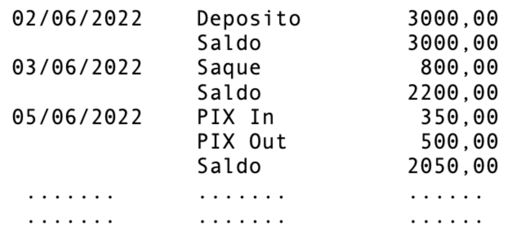

## Contexto

A cidade de Objetolândia possui apenas um banco totalmente online, o Banco Object, que opera apenas contas 
corrente e contas poupança. O setor de TI está desenvolvendo um protótipo como prova de conceito para estudar 
se migra suas aplicações para Java. Seu objetivo é implementar um código coerente com os conceitos estudados e 
de acordo com o cenário apresentado, procurando implementar as boas práticas discutidas durante a disciplina. 
 
O sistema proposto terá algumas classes devidamente organizadas e relacionadas permitindo operações mínimas de 
controle dos recursos financeiros alocados nas contas digitais do Banco Object.  O projeto, com modelo de classes 
livre, porém aderente ao desejado para estudar Herança, classe Abstrata, Interfaces e Polimorfismo, deve atender a 
alguns princípios norteadores da modelagem que são os seguintes: 
- Uma **classe abstrata Conta**, que possui pelo menos os seguintes atributos: número da conta, nome do correntista, CPF do correntista, um atributo para guardar as operações (sugere-se um ArrayList); e pelo menos os seguintes **métodos**: depositar (pelo qual são alocados novos recursos) e sacar (pelo qual são 
retirados recursos). 
A conta deve guardar sua lista de operações (sugere-se objetos de uma classe Operação), sendo que cada 
operação deveria ter pelo menos a data que ocorre, o valor e um identificador de tipo (saque, depósito 
etc.). 
- Duas **subclasses concretas**: conta **Corrente** e conta **Poupança**: 
    - a classe Poupança irá implementar a interface Remunerada 
    - a classe Corrente irá implementar a interface Pix 
- A **interface Remunerada** possui apenas um método relacionado a aplicar taxa de correção e é 
implementada pela classe Poupança. Portanto, quando o Banco escolher aplicar uma correção (por 
exemplo, 1.5%), ele irá verificar em sua lista de contas todas as que são instância de Poupança, e chamará o 
respectivo método para aplicar a devida correção monetária sobre o saldo vigente. 
- A **interface Pix** contém três métodos: 
    - um para cadastrar PIX (que adiciona o CPF do cliente na lista de usuários de PIX), 
    - um para efetuar um PIX (pede o CPF do PIX de destino e o valor para fazer a transferência) e 
    - um para receber um PIX (recebe a origem e o valor a ser creditado). Esta interface é 
implementada pela classe Corrente, que poderá então enviar e receber transferências via PIX. 
- uma classe de execução que contêm a main e as listas static necessárias ao armazenamento dos dados, por exemplo uma classe Banco contendo um ArrayList para Contas e um ArrayList que tem os CPFs das contas 
que aceitam PIX (nem todas as contas correntes precisam se cadastrar no sistema de PIX, apenas as que possuem interesse).

## Sessão Típica
Uma sessão típica (serve como sugestão de organização do menu) consiste em:
1. **criar conta corrente:** cria uma conta corrente
2. **criar conta poupança:** cria uma conta poupança
3. **efetyar deoósito:** efetua um depósito em uma conta (importante: chama o método depositar da classe abstrata, portanto a partir do número da conta informado apenas solicita o valor, pois independe se é Corrente ou Poupança, pegando a data do sistema); 
4. **efetuar saque:** efetua um saque em uma conta (importante: chama o método sacar da classe abstrata, portanto a partir do número da conta informado apenas solicita o valor, pois independe se é Corrente ou Poupança, pegando a data do sistema); 
 
5. **aplicar correção:** o sistema pergunta a taxa de correção e aplica uma operação de correção monetária em todas as contas do tipo Poupança (importante: a operação fica repertoriada na lista de operações da conta, com data e valor que foi calculado conforme o saldo vigente); 
4. **cadastrar PIX:** o sistema pergunta o CPF de um correntista, verifica se ele existe na lista de correntistas, e em caso afirmativo adiciona este CPF a lista de correntistas que podem efetuar transações via PIX; 
5. **efetuar PIX:** o sistema pergunta o CPF do destino da transferência e o valor, verifica se o destinário está na lista de correntistas autorizados, e em caso afirmativo efetua retirada na origem usando o método efetuar PIX e o depósito no destino chamando o método receber PIX, as respectivas operações ficam repertoriadas na lista de operações das respectivas contas;  
6. **consultar extrato:** o sistema pergunta o número da conta (independe de ser Corrente ou Poupança) e exibe o extrato completo de todas as operações efetuadas na conta, mostrando o saldo após cada operação (ou ao final de cada dia que teve operação(ões)). Mostrar em cada linha do extrato a data, o tipo e o valor, consolidando o saldo, algo como (apenas um exemplo básico, dados e formatos podem ser melhor explorados):

## Requisitos

A organização do menu, linear como sugerido acima, ou em níveis, bem como a sequência/nomenclatura ficam 
livres para o estudante decidir, o importante é permitir que sejam possíveis as operações listadas, ou seja, as 
funcionalidades do sistema descritas na sessão típica acima. 
 
Para facilitar a apresentação prática do código funcionando na gravação do vídeo de entrega, deixar algumas contas 
e operações previamentes cadastradas, com criação dos objetos harcoded ou cadastro no sistema em execução 
antes de começar a gravar o vídeo. 
 
A tabela a seguir apresenta as características que serão consideradas (com autoavaliuação em formulário posterior):

| Coluna 1 | Coluna 2 |
|----------|----------|
| Uso adequado das funções static na main com reuso quando módulos compatíveis | Funcionalidade de cadastrar, efetuar e receber PIX  |
| Encapsulamento e métodos das classes empregados adequadamente conforme descrito no contexto e diagrama de classes apresentado no início do vídeo  | Funcionalidade de emitir extrato completo de uma conta usando os atríbutos da classe abstrata |
| Funcionalidade de depósito dos dois tipos de conta, Corrente e Poupança | Respeito aos benefícios da especialização das duas subclasses com métodos adequados nas subclasses concretas e na classe abstrata |
| Funcionalidade de depósito e saque de valores independente do tipo da conta | Criação das duas interfaces, Remunerada e Pix, com sua indicação de métodos abstratos |
| Funcionalidade de aplicar correção monetária em todas as contas da classe Poupança | Respeito das respectivas implementações de interfaces nas duas subclasses concretas |